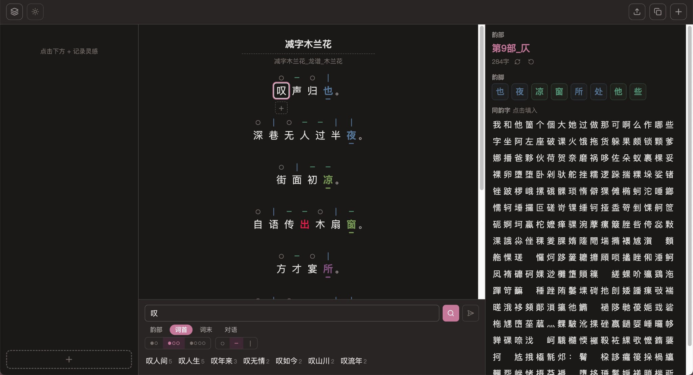

# 方寸 · 诗词创作画布

古典诗词创作辅助工具，提供实时格律校验、韵部查询和词语联想，支持平水韵、词林正韵与中华通韵。

**在线使用：** [write.sjtuguoxue.space](https://write.sjtuguoxue.space)
**API 文档：** [write.sjtuguoxue.space/docs](https://write.sjtuguoxue.space/docs)



## 功能

- **格律校验** — 五/七言律诗绝句 + 2500+ 词牌，实时标注平仄错误与韵脚问题
- **韵部查询** — 平水韵 / 词林正韵 / 中华通韵三套韵书，按词频排序，邻韵关联
- **字典联想** — 词首、词末、对仗查询，45 万首古诗词语料
- **创作画布** — 网格编辑器、灵感板、多画板管理、深色/浅色主题
- **元数据编辑** — 序言、脚注、日期（农历/公历切换），导出图片和上传时自动携带
- **导出图片** — Canvas 渲染诗词卡片，8 套配色方案，2x 高清输出
- **开放 API** — 6 个 HTTP 端点，API Key 认证，供外部开发者和 AI Agent 调用
- **CLI 工具** — `pip install` 后可用 `fangcun` 命令行校验格律
- **Android** — WebView + Chaquopy 内嵌 Python 运行时，全离线运行

## 快速开始

### 本地开发

```bash
# 后端
pip install -r requirements.txt
python app.py                    # Flask on :5050

# 前端
cd frontend && npm install
npm run dev                      # Vite on :3000, 代理 /api → :5050
```

### CLI

```bash
pip install -e .

fangcun validate --text "白日依山尽，黄河入海流。欲穷千里目，更上一层楼。" --genre Shi
fangcun char --char 花
fangcun rhyme --book Pingshuiyun --category 一东
fangcun suggest --term 明月 --mode head
```

### Android APK

```bash
cd frontend && npm install && npm run build && cd ..   # 先构建前端
cd android
./gradlew assembleDebug           # Debug APK → app/build/outputs/apk/debug/
```

Gradle 构建时自动同步 Python 源码、前端产物和配置数据到 APK。基于 Chaquopy 在设备上运行 Flask，WebView 加载 localhost:5050，全离线无需网络。

### API

```bash
curl -X POST https://write.sjtuguoxue.space/api/validate_meter \
  -H "X-API-Key: fc_xxx" \
  -H "Content-Type: application/json" \
  -d '{"poem_text":"床前明月光，疑是地上霜。举头望明月，低头思故乡。","genre":"Shi"}'
```

API Key 申请请邮件至 guoxue_sjtu@163.com，详见 [API 文档](https://write.sjtuguoxue.space/docs)。

## 技术栈

| 层 | 技术 |
|---|------|
| 前端 | React 19 · TypeScript · Vite · Tailwind CSS 4 |
| 后端 | Python · Flask · flask-limiter |
| 数据 | 平水韵 / 词林正韵 / 中华通韵 · 45 万首诗词语料 |
| 部署 | Vercel (Serverless Python + Static) · Android (Chaquopy) |
| 数据库 | SQLite (本地) / Vercel Postgres (线上) |

## 项目结构

```
├── app.py              # Flask 主服务 + API 路由
├── checker.py          # 格律校验引擎
├── config_loader.py    # 数据加载
├── cli.py              # CLI 入口 (fangcun)
├── api_keys.py         # API Key 管理 (SQLite/Postgres)
├── static/
│   ├── config/         # 字典、韵书、规则 JSON
│   ├── docs.html       # API 文档页
│   └── dashboard.html  # 调用统计看板
├── frontend/src/       # React 前端
├── android/            # WebView + Chaquopy 打包
├── api/index.py        # Vercel serverless 入口
└── vercel.json         # Vercel 路由配置
```

## 开发者

上海交通大学国学社 · 技术部

联系：guoxue_sjtu@163.com
